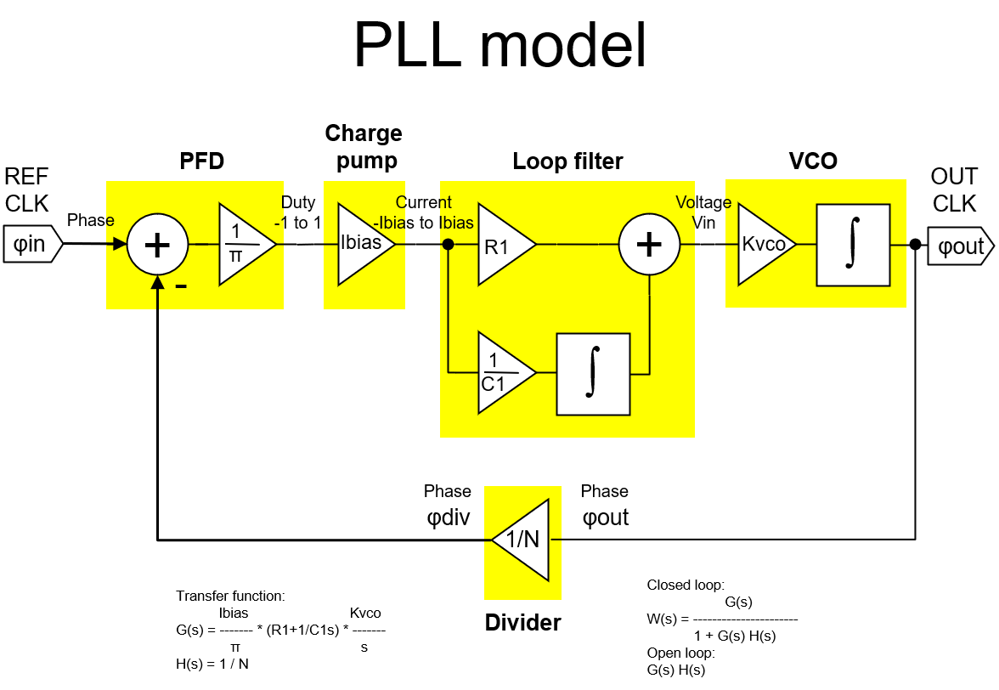
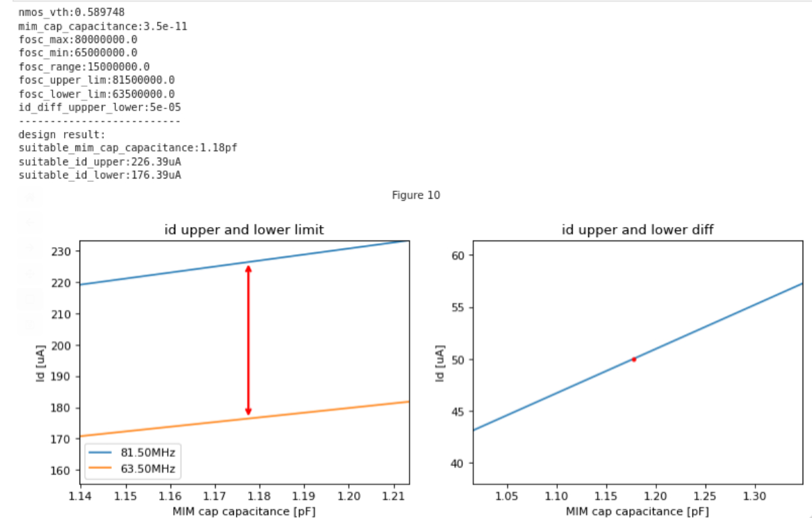

# 2026_sscs
2026 IEEE SSCS chipathon project

# Project overview
Our objective is design general purpose PLL.

# Team member and roles
Yutaka : VCO - Team leader

Jay: PFD

Teddy: Divider

# Design constraints


# Block diagram


# Spec
## Operationg condition 
| Symbol    | Description          | Value |
| --------- |--------------------- | ----- |
|  Vdd      | Power supply voltage | 3.3V  |
|  Vth      | Input Threshold      | 1.65V |
|  Vin(min) | Input voltage (min)  | 0.8V  |
|  Vin(max) | Input voltage (max)  | 2.5V  |
|  Vout(min)| Output voltage(min)  | 0.0V  |
|  Vout(max)| Output voltage(max)  | 3.3V  |

## FM Demodulator mode

| Spec       | Description                              |
| ---------- | ---------------------------------------- |
|  Input Frequency | 76-90MHz(FM RADIO)                       |
|  VCO Frequency   | 65-80MHz(FM RADIO 76-90MHz - IF:10.7MHz) |
| Bandwidth        | 200kHz                                   |

## Clock multiplier mode

| Spec             | Description |
| ---------------- | ----------- |
| Input Frequency  | 10MHz       |
| Output Frequency | 80MHz       |


# Conceptual simulation
[pll_phase_based.ipynb](../designs/libs/model_pll/pll_phase_based.ipynb)


# PFD (Phase Frequency Detector)

# Charge pump

# Loop filter

# VCO
for VCO design,
I think source coupled VCO seem simple and easy to tune frequency than ring OSC.
because of tuning simplicity , this VCO just have one capacitor. current for charge/discharge also controlled by current mirror. important point is defining Vth , oscillation voltage is (Vdd-Vth) to (Vdd-3Vth). 
frequency of OSC is defined:
Fosc = Id / ( 4 * C *  Vth)
before complicated design of vco, we can derive possible FOSC min and max.
## VCO Spec
[tb_vco](../designs/libs/tb_analog/tb_vco/tb_vco.ipynb)



# Divider

# MIM Capacitor
see https://gf180mcu-pdk.readthedocs.io/en/latest/analog/spice/elec_specs/elec_specs_6_4.html
Workaround for LVS issue with MIM capacitor.
add line below on  "$PDK_ROOT/$PDK/libs.tech/netgen/${PDK}_setup.tcl"
```
equate classes "-circuit1 cap_mim_2f0_m4m5_noshield" "-circuit2 cap_mim_2f0fF"
```
to calculate MIM cap capacitance, see below:

[tb_mim_cap.ipynb](../designs/libs/tb_analog/tb_mim_cap/tb_mim_cap.ipynb)

# CMOS

# BGR
see https://note.com/akira_tsuchiya/n/na50333ac5986

# Reference
https://iic-jku.github.io/analog-circuit-design/aicd.html
